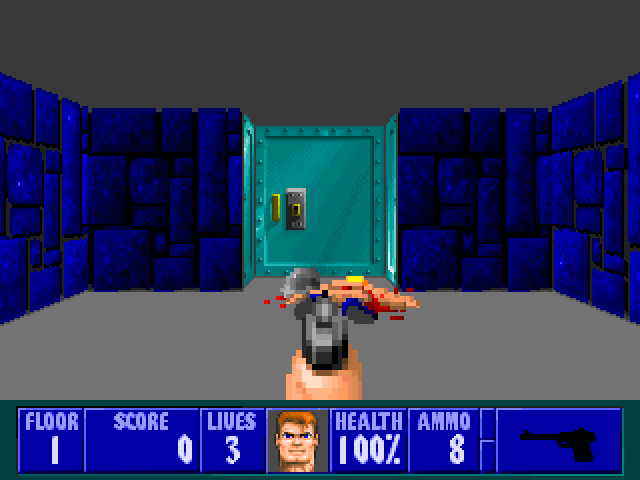
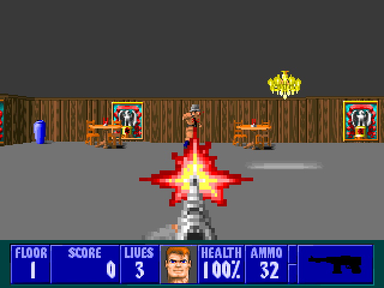
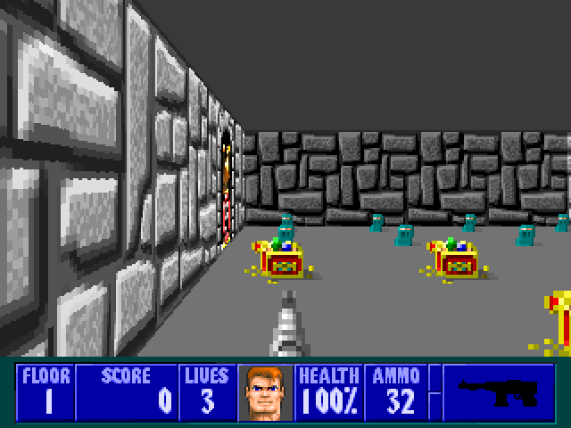
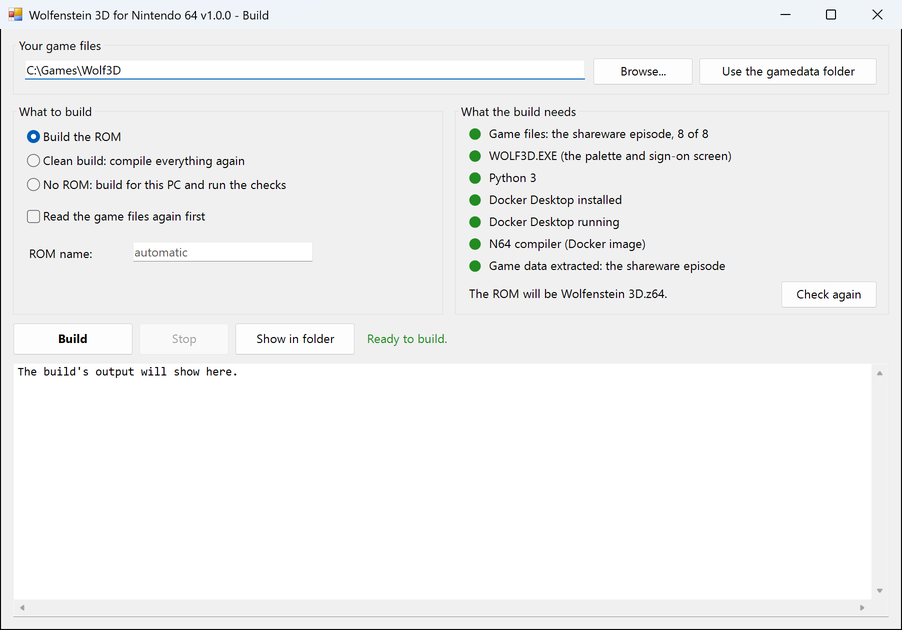

# Wolfenstein 3D for Nintendo 64

An unofficial port of id Software's Wolfenstein 3D to the Nintendo 64,
written from id's own source code. You build it from your own copy of the
game - the shareware episode, the full six-episode game, or Spear of
Destiny - and it plays the way the DOS game did, down to id's recorded demos,
which play out move for move as they do on a PC.

**Version 1.0.0**

None of id's game data is in this repository. The build takes it from your
copy, and the ROM it makes is for your own use only (see
[License](#license-and-what-not-to-redistribute)).

  
  
  

## What's in it

- Every floor of whichever game you build it from, with all the enemies and
  every boss - Spear of Destiny's included - and the death cam
- All four weapons, doors and keys, secret push walls, pickups, lives, and
  id's own status bar
- The music and sound effects
- The DOS menus: New Game, Sound, Control, Load and Save Game, Change View,
  View Scores, and in the shareware Read This!
- The screens between floors, each episode's victory and ending (Spear of
  Destiny's in pictures), and the high score table
- The title, the credits and id's four recorded demos
- A few things the DOS game didn't have: analog stick control, buttons you
  can rearrange, a map of what you've seen, and an Extras menu with the DOS
  game's cheats and a frame-rate counter

## Requirements

**Your own copy of the game** - any one of these:

| Game | Files you need |
| --- | --- |
| the shareware episode | the eight `*.WL1` files and `WOLF3D.EXE` |
| the full game, six episodes | the eight `*.WL6` files and `WOLF3D.EXE` |
| Spear of Destiny | the eight `*.SOD` files and `SPEAR.EXE` (some releases call it `WOLF3D.EXE`) |

The eight files are `VSWAP`, `GAMEMAPS`, `MAPHEAD`, `VGAGRAPH`, `VGADICT`,
`VGAHEAD`, `AUDIOT` and `AUDIOHED`. The executable is needed too: the game's
color palette and its opening screen are stored inside it, not in the data
files.

**To build it**, a computer running Windows, macOS or Linux, with:

- [Python 3](https://www.python.org/) - nothing beyond the standard library
- Docker, running: [Docker Desktop](https://www.docker.com/products/docker-desktop/)
  on Windows or macOS, and Docker Desktop or Docker Engine on Linux. The
  compiler runs inside it, and the first build sets that up by itself.

The build script is `build.ps1` on Windows, run from Windows PowerShell,
and `build.sh` on macOS and Linux, run from a terminal. `build.sh` also runs
from Git Bash on Windows, if that is where you work.

**To play it**, either:

- [ares](https://ares-emu.net/), on a computer whose graphics card supports Vulkan
  - see [Running it](#running-it), since most other emulators can't run it
- or a Nintendo 64 with a flash cart that supports SRAM saves

## Building

1. **Put your game files in the `gamedata` folder** here - or leave them
   where they are and point the build at them (below). Keep one game per
   folder. The file names can be in capitals or not. The folder starts out
   holding only an empty `PUT_YOUR_GAME_FILES_HERE.txt`, to mark the spot;
   it can stay there alongside your files.

2. **Check everything is in place:**

       .\build.ps1          # Windows
       ./build.sh           # macOS, Linux

   This builds nothing. It lists what the build needs - your game files,
   Python, Docker - and marks anything missing, and it tells you what the
   ROM will be called.

3. **Build the ROM:**

       .\build.ps1 -Rom     # Windows
       ./build.sh --rom     # macOS, Linux

   The first build takes several minutes, because it sets up the compiler
   first. Later builds are much quicker.

You get **`Wolfenstein 3D.z64`** from the shareware or the full game, or
**`Spear of Destiny.z64`** from Spear of Destiny, in this folder. The two are named
differently on purpose: emulators and flash carts keep a game's saves in a
file named after the ROM, so each game gets its own saves and high scores.

### Or with a window, on Windows

Double-click **`build-gui.cmd`** for a window that does the same:

- **Your game files:** it starts on this project's `gamedata` folder.
  Browse... chooses another, and Use the gamedata folder goes back to it.
- **What to build:** the ROM, a clean build, or the automated checks, and
  whether to read the game files again first. The ROM name is optional, as
  it is for the script.
- **What the build needs** lights up before you build: green for what's
  there, red for what's missing, amber for what the build will see to by
  itself, and grey for what can't be checked yet. The last two lines are
  the build's own pieces rather than things you install: the **N64
  compiler** is a Docker image the first build makes (several minutes, once),
  and the **game data** is your game files converted for the ROM - the line
  names the game that's converted, and if your folder holds a different one,
  says it's switching, and the build reads your files again by itself.
  **Build** stays unavailable until
  everything the build needs is green, and the line beside it says what's
  still missing. The window checks again when you come back to it, and every
  few seconds while Docker Desktop is starting, so the lights change by
  themselves.
- **Build** runs `build.ps1` and shows its output as it goes. **Stop** ends
  the build, including the compiler working inside Docker. **Show in folder**
  opens the folder with the ROM you just built selected.

It remembers your choices for next time, in `build-gui.json` beside it
(delete that file to start from the defaults).

### Building from somewhere else, or switching games

    .\build.ps1 -Rom -Data D:\Games\SPEAR        # Windows
    ./build.sh --rom --data ~/games/SPEAR        # macOS, Linux

Naming a folder always reads the game from it again, so this is also how to
switch from one game to another. Without it, a build reuses whichever game
was read last.

### Other options

Add these to the command, as in `.\build.ps1 -Rom -Name "Wolfenstein 3D (full)"`
or `./build.sh --rom --name "Wolfenstein 3D (full)"`:

| Windows | macOS, Linux | What it does |
| --- | --- | --- |
| `-Name "Wolfenstein 3D (full)"` | `--name "Wolfenstein 3D (full)"` | calls the ROM `Wolfenstein 3D (full).z64` instead |
| `-Assets` | `--assets` | reads the game files in `gamedata` again, then builds |
| `-Clean` | `--clean` | throws away everything compiled and builds it all again; the game data already read is kept (add `-Assets` or `--assets` to redo that too) |
| `-Sim` | `--sim` | builds the game for your computer instead and runs its automated checks, saving pictures of the frames to `build/sim` |

`.\build.ps1 -Help` or `./build.sh --help` shows these, with examples.

### On macOS and Linux

- If `./build.sh` says "permission denied", the file lost its executable
  mark on the way here - copying from Windows or out of a zip can do that.
  Run `chmod +x build.sh` once, or use `bash build.sh` instead.
- On Linux, Docker must work without `sudo`: add yourself to the `docker`
  group, as in Docker's
  [post-installation steps](https://docs.docker.com/engine/install/linux-postinstall/).
  The build runs the compiler as you, so what it writes - `build/` and the
  ROM - is yours.

`build.sh` has been tested on Ubuntu Linux and in Git Bash on Windows, where
it builds ROMs identical to `build.ps1`'s, and under bash 3.2, the version
macOS includes - but not yet on a Mac.

## Running it

Open the ROM in **ares**. It is the emulator recommended by libdragon, the
toolkit this port is built with, and the one the port was developed and
tested on (version 148). Turning on its **Homebrew mode** adds checks for
things that would go wrong on a real console.

Most other Nintendo 64 emulators can't run it reliably. They were made to play
commercial games, which were all built with Nintendo's own development kit,
and they take shortcuts that only work for Nintendo's code - which this port
doesn't use. What was tried:

- **simple64 v2024.12.1** runs it, but now and then freezes - sometimes
  after seconds, sometimes after many minutes. A tiny test program with none of
  the game's code in it freezes the same way, and runs cleanly on ares, so
  it isn't something in the port.
- **Mupen64Plus 2.6** and **Project64 3.0.1** don't get it running.
  libdragon's own example programs fail the same way on both, so it isn't
  something the port can change.

**On a real Nintendo 64** you need a flash cart that supports SRAM saves:
the ROM asks for 256 Kbit of battery-backed SRAM for its saves and settings.
So far it has been tested under ares, not on a console.

For more on why emulators differ here, see
[Emulators](docs/TECHNICAL_DETAILS.md#emulators) in the technical details.

## Playing

### Controls

| Input | Action |
| --- | --- |
| Analog stick / D-pad | turn and walk (the stick's sensitivity is set in Control) |
| C-left, C-right | strafe |
| R + stick / D-pad | strafe instead of turning, as holding Alt did in DOS |
| L | show or hide the map of what you have seen (the game keeps running) - on release |
| L + R | pause; only L + R again carries on (Start still opens the menu) |
| Z (trigger) | fire - hold it for the machine gun and gatling gun |
| C-up, C-down | next / previous weapon you own |
| B | run (double speed, as in the DOS game); with Control's Always Run on, walk |
| A | open a door, push a secret wall, or ride the elevator (gold doors need the gold key) |
| Start | the menu (Esc in DOS) |

Those are the defaults. **Control > Customize controls** in the menu can
give any of those actions to another button; Start always opens the menu.
The stick always does whatever the D-pad does, the menus always use A, B and
the D-pad or stick, and L + R always pauses.

### Getting around

The game opens on its sign-on screen - press a button to go on (Spear of
Destiny's moves on by itself after three seconds) - then shows the title,
the credits, the high scores and id's demos in turn. Press A, B, Z or Start
on any of them for the main menu.

- **In the menus**, up and down move the cursor, A or Start selects, and B
  goes back. In a yes/no box, A is yes and B is no.
- **Between floors**, the elevator switch shows the end-of-floor stats. A, Z
  or Start skips the count, and a second press goes on.
- **Secret floors:** each episode has a hidden elevator to a secret floor 10.
- **Ending an episode:** beat the boss on its ninth floor. Spear of Destiny
  runs as one campaign of 21 floors, two of them secret, and ends with the
  Angel of Death.
- **Text pages** (the endings and Read This!): left and right turn pages, A
  goes on, and B or Start leaves.

### Saving

Save Game and Load Game have ten slots, kept on the cartridge's
battery-backed SRAM. Your settings and the high score table are kept there
too, and saved as soon as they change. Wolfenstein and Spear of Destiny each
keep their own saves and high scores, even on a shared cartridge.

### The map and Extras

**L** shows a map of what you have seen of the floor so far. The game keeps
running while it's up.

**Extras**, in the main menu where DOS had Quit, has a frame-rate counter
and a profiler overlay, and the DOS game's cheats: God Mode, No Clip,
Health, Ammo & Keys (the M-L-I code), Free Items, Warp to Floor and End
Floor. The on/off ones - the counter, the overlay, God Mode and No Clip -
stay as you set them, even across power-off.

## More details

[TECHNICAL_DETAILS.md](docs/TECHNICAL_DETAILS.md) covers how the port works and
how closely it follows id's code: how the game data is converted, the
renderer, the enemies, sound and music, every menu screen, saved games,
where and why it departs from the DOS game, performance, and the automated
checks that play every floor and compare the demos against the original.

## License, and what not to redistribute

### The code: GPL version 2

This port is free software under the **GNU General Public License, version
2** (see `COPYING`).

It is written from id Software's 1995 source release of Wolfenstein 3D
([id-Software/wolf3d](https://github.com/id-Software/wolf3d)). That release
carries only id's "Limited Use Software License Agreement". The GPL basis is
id's later release of the game's code under the GPL: the Wolfenstein 3D
Classic iPhone source ([id-Software/Wolf3D-iOS](https://github.com/id-Software/Wolf3D-iOS),
2009, "WOLF3D iOS v2.1 GPL source release"), whose engine descends from the
DOS code through Wolf3D Redux and NewWolf. On that basis the original source
has been treated as available under the GPL - Wolf4SDL, for one, offers it
under the choice of id's license or the GPL - and this port relies on the
same reading. The iPhone release has no counterpart for some of the DOS
files this port also follows (the menus, the stats screens, the text pages,
the sound manager's rules); for those the port relies on that reading
rather than on code id itself published under the GPL.

Wolfenstein 3D is id Software's (now ZeniMax Media's), and "Wolfenstein 3D"
is their trademark. This is an unofficial port, not endorsed by either.

`tools\audio\nuked-opl3` is Nuked-OPL3 by Nuke.YKT, under the LGPL 2.1 or
later (its `LICENSE` is alongside). It is compiled into the build-time
tools (`render_audio`, `imf2xm`, `adlib_check`), and `src\adlib.c` is cut
down from it for the sound effects the
N64 synthesizes, so **that file, and the ROM it is linked into, carry the
LGPL** (see [Sound and music](docs/TECHNICAL_DETAILS.md#sound-and-music)), which the GPL is compatible with.

### The data: yours, and not to be passed on

The GPL covers code, not id's game data; the iPhone release says so itself
("the game data remains subject to the original EULA and applicable law").
**None of id's game data is in this repository, and a built ROM must not be
passed on.** The build takes it from you:

- the game: `VSWAP`, `GAMEMAPS`, `MAPHEAD`, `VGAGRAPH`, `VGADICT`,
  `VGAHEAD`, `AUDIOT` and `AUDIOHED` - `.WL1` for the shareware, `.WL6` for
  the full game, `.SOD` for Spear of Destiny - and the executable
  (`WOLF3D.EXE`, or Spear of Destiny's `SPEAR.EXE`), which holds two pieces
  of artwork the data files do not: the palette and the sign-on screen. The
  extractor finds them without keeping any of either here - the palette by
  the standard EGA colors it starts with, the sign-on screen by a hash.

`tools\extract_assets.py` converts those into `assets\wolf3d.dat`,
`assets\wolfbig.dat` and `assets\audio\`, which the ROM is built from. So
those, and any `.z64`, are derived from id's copyrighted data:

- The shareware release could be passed on as a **complete, unmodified
  package**. A ROM holds converted, repacked pieces of it, which is neither,
  so that permission does not cover it.
- Full-game (`.WL6`) and Spear of Destiny (`.SOD`) data were sold and were
  never redistributable at all.

`.gitignore` keeps all of it out of the repository. Share the source and let
people build with their own copy of the game.
